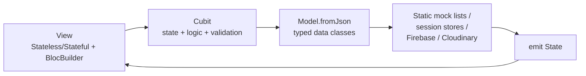
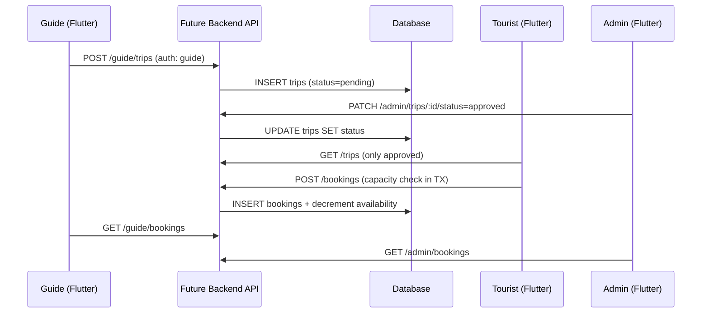
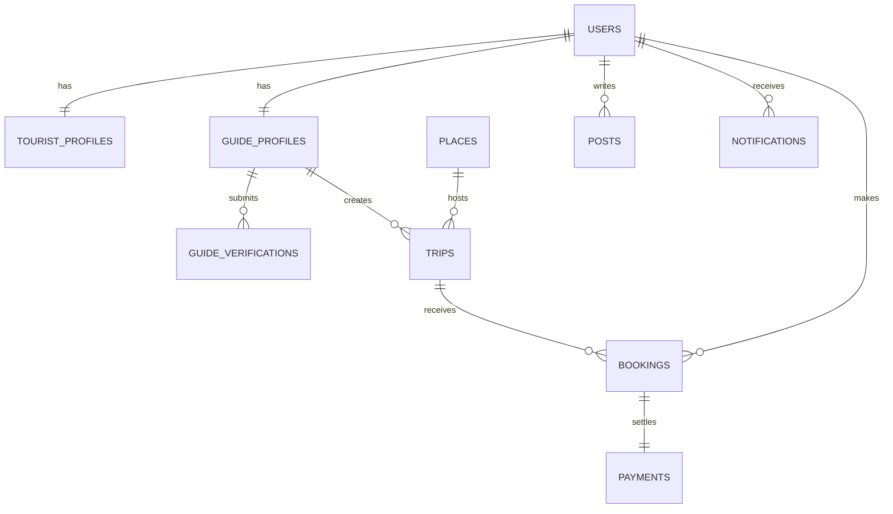
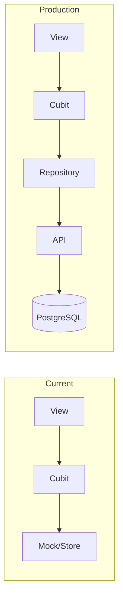

# Triply — Master Technical Documentation

> Single source of truth for understanding the Triply Flutter app and planning its Backend/Database integration.
> Verified against source on 2026-10-09. Project root: `D:\applications flutter\triply`.
> Status labels used throughout: `EXISTS` · `PARTIALLY IMPLEMENTED` · `MOCK / LOCAL ONLY` · `NOT IMPLEMENTED` · `NEEDS VERIFICATION` · `RECOMMENDED` · `ASSUMPTION`.

## 1. Document Information and Source Register

| Item | Detail |
| ---- | ------ |
| Project root | `D:\applications flutter\triply` (Flutter + git root) |
| Entry point | `lib/main.dart` |
| Deliverable | `docs/TRIPLY_MASTER_DOCUMENTATION.md` (this file) |
| Analysis date | 2026-10-09 |
| Analysis method | Fresh source reads (`lib/`, `pubspec.yaml`, `.env` presence only, `android/`, `ios/`), full `lib/features` inventory, data-layer import tracing, plus 3 parallel read-only audit agents |

**Previous analysis files read as supporting evidence (verified against code, NOT blindly trusted):**

| Document | Verdict |
| -------- | ------- |
| `docs/refactor-mvcw-plan.md` (32 lines) | **STALE/SUPERSEDED** — describes an old tree (`lib/views/`, `map_screen.dart`, `DummyController`, capital-L filenames). None of those paths exist anymore; the migration it plans is long finished. Kept for history only. |
| `docs/Triply_Technical_Report.pdf` | Current; consistent with this analysis (same architecture verdict, same backend direction). This master doc supersedes it in depth. |

**Code areas examined:** all of `lib/features/{common,tour_guide,tourist,admin_dashboard}` (36 feature folders), `lib/core/{constants,data,helper,network,services,theme,widgets}`, `lib/data/mock`, `lib/main.dart`, `lib/firebase_options.dart`, `pubspec.yaml`, `pubspec.lock`, `test/`, `assets/`, `android/.../AndroidManifest.xml`, `ios/Runner/Info.plist`, `.env` (existence only — values never read).

## 2. Executive Summary

Triply is a Flutter travel app (Egypt) with three roles — Tourist, Tour Guide, Admin — sharing one codebase. **Architecture: MVVMW + Cubit almost everywhere** (`View → Cubit(State) → Model.fromJson → static mock/session store`), with three deliberate exceptions: global/local auth session via `Provider`+`ChangeNotifier`, two stateless screens, and one `CheckoutController` compatibility wrapper. **All runtime data is mock/local** except Firebase Auth session + the Firestore `users` collection and Cloudinary uploads. The three roles are **runtime silos**: no live data flows between Tourist, Guide, and Admin. `flutter analyze` is clean (0 errors/warnings). No tests exist beyond the template counter test. Recommended backend: **NestJS + PostgreSQL**, keeping Firebase Auth as identity provider.

## 3. Project Inventory

### 3.1 Top level (`lib/`)

| Path | Responsibility | Layer |
| ---- | -------------- | ----- |
| `lib/main.dart` | Firebase init, dotenv load, `MultiProvider(AuthProvider)`, auth-gate home, named-routes table | Infrastructure |
| `lib/firebase_options.dart` | Generated Firebase config (Android/iOS/Web keys) | Infrastructure |
| `lib/features/common/` | `AuthTourist` (6 screens, provider, repository), `AuthTourguide` (3 views, provider, service) | Feature |
| `lib/features/tourist/` | 15 features (all Cubit, see §5) | Feature |
| `lib/features/tour_guide/` | 9 modules (7 Cubit, 2 stateless) | Feature |
| `lib/features/admin_dashboard/` | 10 modules (1 Cubit in `d_auth`, 9 `setState` views) | Feature |
| `lib/core/` | constants, data/stores/mocks, helper, network stub, services, theme, widgets | Shared |
| `lib/data/mock/` | 5 Admin mock files (`d_mock_*`) | Mock data |
| `lib/assets/images/photo.dart` | Asset path constants | Shared |

### 3.2 Core (`lib/core/`)

| Path | Responsibility | Consumers |
| ---- | -------------- | --------- |
| `constants/app_routes.dart` | `AppRoutes`: 11 named constants + `MaterialPageRoute` builders (`trips/popular/tripDetails/booking/myTrips/guideTrips/guideTripDetails/travelers/createTrip/editTrip/manageTrip/guideProfile/earnings/bookingConfirmed`, helpers `goToMyTrips/backToTrip`) | All tourist/guide navigation |
| `constants/d_app_routes.dart` | Duplicate `class AppRoutes` (admin paths) — **unused, never imported**; importing it would collide | None |
| `constants/app_asset.dart`, `tour_guide_colors.dart` | Asset/icon paths, guide palette | Feature UI |
| `data/guide_trips_store.dart` | Static session store: created+edited `GuideTrip`s, listener fan-out, `allTrips()` | guide dashboard/my_trips/create cubits, availability |
| `data/my_bookings_public.dart` | Static session bookings map (`record/recordPrivate/cancelBooking/seatsFor/totalPaidFor`, all start `pending`) | booking cubits, my_trips, trip_details, profile counter |
| `data/trip_details_source.dart`, `guide_trip_details_source.dart` | Mock-JSON lookup with fallback + session `_overrides`/`save()` | trip/guide details cubits, create cubits |
| `data/mock/tourist/` (16 files), `mock/tourguide/` (8 files) | Static JSON-like lists (§11) | Per-feature cubits |
| `helper/price_format.dart` | `formatEgp` thousands formatter (currency-agnostic) | Price labels |
| `network/api_client.dart` | **STUB**: `ApiConstants.baseUrl=https://api.triply.example`, empty `ApiClient`; zero importers | Future backend |
| `services/cloudinary_service.dart` | Unsigned upload (`gfhygmmz`/`triply_tour_guide_info`, folder per uid, empty-file guard) | Guide verification screen only |
| `theme/` (`app_colors/theme/text_styles`, `d_app_*` admin theme) | Colors, typography, `buildAppTheme()` | All UI |
| `widgets/` (12 shared: bottom navs, back buttons, snackbar, `NetworkImageFallback`, `TripImage`, cards, chips) | Reused UI primitives | All features |

### 3.3 Entry, routes, config

`main()` (`main.dart:21-27`) → Firebase init → dotenv load (best-effort) → `MultiProvider(AuthProvider)` → auth gate: `initial` = spinner, otherwise always `RoleSelectionScreen` (no auto-home). Routes table (`:56-70`) covers tourist core only; guide/admin navigate via `AppRoutes` builders / direct `MaterialPageRoute`. `pubspec.yaml`: Flutter + `flutter_bloc: ^9.1.1`, `provider: ^6.1.2`, Firebase (`core/auth/firestore/storage`), `google_sign_in`, `http`, `flutter_dotenv`, `url_launcher`, `image_picker`, `file_picker: ^13.1.0`, `webview_flutter` (Paymob), `cloudinary_public`, maps (`google_maps_flutter` declared but **zero imports**; active map is `flutter_map` + OSM tiles), fonts/icons. Assets: `.env` (exists; values never read per security rule), `assets/images/svg/` (2 icons). `test/`: only template counter test (effectively dead). `android/.../AndroidManifest.xml` holds `tel:` queries + `MAPS_API_KEY` placeholder; `ios/Runner/Info.plist` holds `tel` scheme + `MAPS_API_KEY` placeholder.

## 4. Current Architecture

**Verdict: MVVMW + Cubit is the real architecture in 33 of 36 feature folders.** Data flow everywhere:



**Exceptions (verified):** (1) `common/AuthTourist` + `common/AuthTourguide` — `Provider`+`ChangeNotifier` session singletons consumed in ~12 places incl. `main.dart` gate; migrating them risks the auth flow for zero behavioral gain. (2) `tour_guide/onboarding`, `role_selection` — no controllers, local `setState`/stateless only; Cubit would be artificial. (3) `tourist/checkout` — `CheckoutController` kept as a thin delegating wrapper (frozen `booking_public` also instantiates it); the cubit is the single source of truth. (4) Admin pages (except `d_auth`) — local `setState` over mock copies by design decision (frontend-only admin).

**Debt noted (not changed):** three divergent `Guide`/`Trip`/`Place` model variants across tourist/guide/place_details; duplicate `AppRoutes` class in `d_app_routes.dart`; orphan mocks (`mock_guide_raw.dart`, `mock_guide_profile.dart`); empty `tourist/booking/controller/` dir; `firebase_storage` + `google_maps_flutter` declared but unused.

## 5. Feature-by-Feature Architecture Map

| Feature | State | Flow (actual classes) |
| ------- | ----- | --------------------- |
| tourist/home | `HomeCubit/State` | `HomeScreen → HomeCubit → Place/Guide/Trip.fromJson → mock_places/guides/trips_raw` |
| tourist/search | `SearchCubit/State` | `SearchScreen → SearchCubit → Place.fromJson → mockPlaces (+mock_search recents)` |
| tourist/map | `MapCubit/State` | `MapScreen → MapCubit → Place → mockPlaces` (+flutter_map tiles) |
| tourist/place_details | `PlaceDetailCubit/State` | `PlaceDetailScreen → Cubit → Place/Guide/Trip/Story → mock_places/guides1/stories/place_trips` |
| tourist/trips, popular | Cubits | `→ Trip → mockTripsJson` |
| tourist/trip_details | `TripDetailsCubit/State` | `→ TripDetails → TripDetailsSource(mockTripDetailsJson)` |
| tourist/guides | `GuidesCubit + GuideProfileCubit` | `→ Guide → mockGuides` |
| tourist/booking | `BookingCubit/State` | `→ Booking → PriceCalculator + Guide/Place mocks → MyBookingsPublic.recordPrivate` |
| tourist/booking_public | `BookingPublicCubit/State` | `→ BookingPublic → MyBookingsPublic.record → MyTripsScreen` |
| tourist/checkout | `CheckoutCubit` + wrapper | `→ PaymobService (auth→order→paymentKey) → PaymobWebviewScreen` |
| tourist/my_trips | `MyTripsCubit/State` | `→ Trip (recorded seats/totalPaidFor override) → MyBookingsPublic` |
| tourist/notifications | `NotificationsCubit/State` | `→ NotificationItem → mockNotificationsRaw` (mark-all/one-read) |
| tourist/community | `CommunityCubit/State` | `→ CommunityPost/Story → mock_community (+local picked files)` |
| tourist/UserProfile | `ProfileCubit/State` | `→ EmergencyContact/static SOS 123·122·180 → mocks + Firebase user` |
| tour_guide/create_trip_tg | `CreateTripCubit/State` | `→ GuideTripDraft + GuideTrip/GuideTripDetails → GuideTripsStore + DetailsSource.save()` |
| tour_guide/my_trips_tg, trip_details_tg, travelers_tg, earnings_tg | Cubits | `→ GuideTrip(/Details)/Traveler/Earnings → GuideTripsStore + tourguide mocks` |
| tour_guide/homeandNotificationTr | 3 Cubits | `DashboardCubit (store listener + verification gate) / GuideNotificationsCubit / BookingDetailsCubit → dashboard/booking mocks` |
| tour_guide/profile_tg | `ProfileTgCubit/State` | `→ Firebase user + Firestore users/{uid} (phone/about/location) + tourist Guide mock fallback` |
| tour_guide/onboarding, role_selection | setState/stateless | Local only |
| common/AuthTourist/AuthTourguide | Providers + Repositories | Firebase Auth + Firestore `users` (+GoogleSignIn for tourist) |
| admin_dashboard/d_auth | `AdminAuthCubit/State` | `→ AdminSession (in-memory) + triplykl rule` |
| admin pages (9) | local setState | `→ d_mock_*` copies, per-screen state |

## 6. Tourist Complete Flow

`main` → Firebase init → auth gate → `RoleSelectionScreen` → Tourist card → `OnboardingScreen` (Get Started → SignIn) → Login (email/Google) or Create Account (name/Egyptian-phone/email/password → `users/{uid}` merge) → `pushReplacementNamed('/home')` → `HomeScreen`. Bottom nav pushes Home/My Trips/Map/Community/Profile (each screen owns its nav; no shell). Search → `PlaceDetailScreen(placeId)` (About/Guides/Trips/Stories tabs). `TripsScreen` → `TripDetailsScreen(trip)` → public `booking(Trip)` (seats ≤ capacity−peopleCount, 5% fee, Paymob webview, record) or guide profile → private `BookingScreen(guideId)` (place → date/time/duration → travelers/meeting/notes → confirm `$` total → Paymob → private record) → `BookingConfirmedScreen` → My Trips (Upcoming/Ongoing/Completed/Cancelled, recorded seats+total, cancel/delete with refund snackbar). Profile (Firebase identity + Firestore phone + SOS + privacy reset + logout → RoleSelection). Community (composer → posts/stories, own-delete, likes). **MOCK/LOCAL ONLY:** all lists, bookings, posts, earnings of data; **EXISTS truly:** Firebase session, Firestore `users` profile/phone/verification map, Cloudinary uploads, Paymob sandbox flow.

## 7. Tour Guide Complete Flow

Onboarding → Login (`signInGuide` returns role; verified → Dashboard else Verification; tourist-role → tourist Home) / Signup (`+20` phone, license, languages → Verification). Verification: `FilePicker` (jpg/png/pdf ≤10MB) → `CloudinaryService.uploadFile` ×2 → `submitVerificationDocuments` (`reviewStatus: pending`, `canPublishTrips: false`) → Dashboard; Skip also lands home. Registration persists in Firebase Auth + `users/{uid}` (`role: guide`, `isApproved: false`); **no approver exists — verification stays pending forever** (`PARTIALLY IMPLEMENTED`). Dashboard (`GuideDashboardScreen`, banner hidden only when Firestore says approved). My Trips (status tabs; create → `submitTrip` stores `GuideTrip` + full `GuideTripDetails` override → Pending → View/Edit prefilled → Travelers → Earnings (mock EGP)). Profile (name/photo via Firebase; phone/about/location via Firestore merge; avatar shared with dashboard via `AuthProvider`). Availability/Notifications/Settings exist as local screens. Logout → RoleSelection. **MOCK/LOCAL ONLY:** trips, travelers, earnings, dashboard stats; session statics cleared on restart.

## 8. Admin Dashboard Complete Flow

Entry ONLY via role-selection footer → `AdminLoginView`/`AdminCreateAccountView` (`AdminAuthCubit`; demo rule email contains `triplykl`, message `You are not allowed to access the Admin Dashboard.`). Success → `HomeView` shell (desktop sidebar / mobile drawer, 8 indexed pages) wrapped in `BlocProvider(AdminAuthCubit.authenticated(session))`; header/sidebar show session name. Pages: Overview (hardcoded stats + local guide approve/reject/suspend), Users/Bookings/Trips/Posts/Applications (search-filtered `d_mock_*` tables, view dialogs, suspend/cancel/remove on local copies), Guides (approve/reject/suspend + details incl. phone + trip dialog), Settings (local commission/mode + saved snackbar). Logout → `Are you sure you want to logout?` → session cleared → `pushAndRemoveUntil(RoleSelectionScreen)`. **All admin state is per-screen local + in-memory session; nothing syncs with Tourist/Guide; nothing persists.**

## 9. Cross-Role Connections

**Current implementation: the roles are runtime silos.** Shared surface is only: Firebase Auth session, the `users/{uid}` document shape, static mock files, and the `RoleSelectionScreen`. Specifically: guide-created trips (`GuideTripsStore`) are invisible to tourists (`mockTripsJson`) and Admin (`d_mock_*`); tourist bookings (`MyBookingsPublic`) are invisible to guides/Admin; verification docs reach Cloudinary + Firestore but Admin never reads them (admin approve buttons mutate local mocks); tourist posts never reach Admin. **Do not assume any cross-role sync exists.**



## 10. Navigation Audit

| Route / Call | Source | Destination | Args | Role | Status |
| ------------ | ------ | ----------- | ---- | ---- | ------ |
| `/home,/search,/notifications,/onboarding,/sign-in,/create-account,/forgot-password,/password-reset-success,/profile,/privacySecurity,/emergency` | `main.dart:56-70` | tourist screens | none | Tourist | EXISTS |
| `AppRoutes.trips/popular/tripDetails(trip,isBooked)/booking(trip)/myTrips()` | `app_routes.dart:48-89` | tourist flows | models | Tourist | EXISTS |
| `guideTrips(status)/guideTripDetails(trip)/travelers(trip)/createTrip/editTrip/manageTrip/guideProfile(id)/earnings()` | `app_routes.dart:91-156` | guide flows | models | Guide | EXISTS |
| `goToMyTrips/backToTrip/bookingConfirmed` | `app_routes.dart:160-186` | stack helpers | models | Tourist | EXISTS |
| Role cards/footer | `role_selection_screen.dart:73-109` | onboarding ×2, `AdminLoginView` | none | All | EXISTS |
| Bottom navs (push-based, per-screen) | `app_bottom_nav.dart`, guide `guide_bottom_nav.dart` | sibling screens | none/ids | Tourist/Guide | EXISTS |
| Admin shell | `d_home_view.dart` | 8 indexed pages | none | Admin | EXISTS |
| `d_app_routes.dart` duplicate `AppRoutes` | unused | — | — | — | NOT IMPLEMENTED (dead) |

Back behavior: `CircleBackButton`/`CircleIconButton` (pop), dialogs close, logout uses `pushAndRemoveUntil(RoleSelectionScreen)` in all roles.

## 11. Authentication and Authorization

Current: Firebase email/password (+Google for tourist), Egyptian phone validation, Firestore `users/{uid}` (`fullName/email/phone` tourist; `name/email/phone/role/licenseNumber/languages/isApproved/about/location + verification{}` guide). Sessions persist via `authStateChanges`; admin session is in-memory only. **Authorization today: NONE server-side** (admin = `triplykl` substring demo rule). Proposed: keep Firebase as identity provider (verify ID tokens), add `role` claim + middleware, JWT access/refresh for non-Firebase clients, `bcrypt` for any server-side passwords, `role=admin` enforcement on `/admin/*`.

## 12. Business Logic Analysis

`Input → Validation → State change → Logic → Model transform → Mock/Service → Result → UI`. Traced examples: tourist signup (Egyptian regex → Firebase + Firestore merge → /home); public booking (seats clamp → 5% fee math → Paymob token → record → confirmed screen); private booking (`pricePerHour × hours × travelers` in guide currency); guide create (validate name+price → `GuideTrip(status:pending)` + details override → Pending tab); verification (10MB/type check → Cloudinary ×2 → Firestore pending); search (lowercase substring over 4 fields); community (composer result → cubit prepend; own-delete guarded); admin approve/reject (local list rebuild). **NOT IMPLEMENTED:** capacity races, duplicate-booking protection, real verification review, payment capture server-side.

## 13. Data-Layer Audit

Stores (all static, restart-cleared): `GuideTripsStore`, `MyBookingsPublic` (all records start `pending`), `TripDetailsSource`/`GuideTripDetailsSource` (mock lookup + `_overrides.save()`). No `SharedPreferences/Hive/sqflite/secure-storage` anywhere (verified zero hits). `fromJson` exists on every model. `ApiClient` is an empty stub. Cloudinary: unsigned preset + per-uid folders (verification) + separate avatar flow; secrets hardcoded (see §26). Maps: `flutter_map` + OSM live tiles; `google_maps_flutter` declared but unused. Duplicate models: 3× Guide/Trip/Place variants; orphan mocks: `mock_guide_raw.dart`, `mock_guide_profile.dart`.

## 14. Technical Stack

| Area | Package / File | Use | Status |
| ---- | -------------- | --- | ------ |
| UI | Flutter Material, `google_fonts`, `flutter_svg`, `lucide_icons_flutter`, `iconsax_flutter`, `cupertino_icons` | All screens | EXISTS |
| State | `flutter_bloc: ^9.1.1` (cubits), `provider: ^6.1.2` (auth session) | App-wide | EXISTS |
| Routing | `MaterialApp.routes` + `AppRoutes` builders, direct `MaterialPageRoute` | App-wide | EXISTS |
| Network | `http: ^1.6.0` (Paymob, Cloudinary avatar flow) | Checkout, uploads | EXISTS |
| Storage | None (no prefs/Hive/SQLite — verified) | — | NOT IMPLEMENTED |
| Cloud | `firebase_core/auth/firestore/storage`, `google_sign_in`, `cloudinary_public`, `flutter_map`+OSM | Auth, uploads, map | EXISTS (storage/maps partially unused) |
| Inputs | `image_picker`, `file_picker: ^13.1.0`, `url_launcher`, `webview_flutter` | Gallery, docs, dialer, Paymob | EXISTS |
| Config | `flutter_dotenv` (.env exists; values never read) | Maps/Paymob keys | EXISTS |
| Tests | `flutter_test`, single template counter test | `test/widget_test.dart` | NOT IMPLEMENTED (dead) |

## 15. Maps and Location System

`MapScreen`/`MapCubit` (`tourist/map/`): `flutter_map` + OpenStreetMap tiles, Egypt center (26.8206, 30.8025), markers from `mockPlaces` lat/lng, search + category chips, preview card → `PlaceDetailScreen(placeId)`. No trip origin/destination feature (`NEEDS CLARIFICATION` if required). `google_maps_flutter` is declared but has zero imports. Keys via `.env`/`MAPS_API_KEY` placeholders (values never inspected). **Backend role:** serve places/geo from DB (PostGIS optional), keep tile rendering + location services on-device.

## 16. Mock/Local Data Inventory

| Mock source | Used by | Future API | Future DB |
| ----------- | ------- | ---------- | --------- |
| `mock_places` (~3800 lines POIs) | map/search/place/home/booking | `GET /places` | `places` |
| `mockTripsJson` (t1-t3) | trips/popular/my_trips/home | `GET /trips` | `trips` |
| `mockGuides` (+`mock_guides1`, orphans `mock_guide_raw`) | guides/home/booking/dashboard | `GET /guides` | `guide_profiles` |
| `mockTripDetailsJson` (+`GuideTripDetailsSource`) | trip details/booking | `GET /trips/:id` | `trips` + images |
| `MyBookingsPublic` static | my_trips/profile | `GET /bookings/my` | `bookings` |
| `GuideTripsStore` static | dashboard/my_trips/create | `GET /guide/trips` | `trips` |
| `mockCommunity*`, `mockStories` | community, place stories | `GET /feed`, `POST /posts` | `posts/stories` |
| `mockNotificationsRaw` | notifications | `GET /notifications` | `notifications` |
| `mock_profile`, `mock_emergency_contacts` | UserProfile | `GET /me` | `users` |
| tourguide mocks (8) | dashboard/trips/details/earnings/travelers | `GET /guide/*` | respective |
| `d_mock_*` (5) | admin pages | `GET /admin/*` | respective |
| Strategy: per-feature strangler — add Repository + RemoteDataSource behind each Cubit, keep mock as fallback, flip one feature at a time. UI/models unchanged. |

## 17. Backend Architecture Recommendation

**Primary: NestJS + PostgreSQL.** Why for THIS app: typed DTOs mirror the 30+ Dart models 1:1; relational integrity for booking capacity races + approval workflows; guards/interceptors map to the role matrix; Firebase Admin SDK verifies the existing client identity (no login rewrite); team already thinks in providers/services. Express = less structure for this entity graph; Laravel = language split from a Dart team; Firebase-only = no transactions/complex queries for booking + paywalled queries. Structure: `modules/{auth,users,trips,bookings,community,admin}/(controller,service,repository,dto,entities) + common(auth guard, validation pipe, error filter, storage service, config)`.

## 18. Database Design and Relationships

PostgreSQL (`RECOMMENDED`; JSONB for itinerary/highlights; `pg_trgm` for name search; money as integer minor units; timestamptz UTC).

| Table | Key fields | Relationships |
| ----- | ---------- | ------------- |
| `users` | id PK, email UNIQUE, phone, role[tourist\|guide\|admin], display_name, avatar_url | 1—1 tourist/guide profiles |
| `tourist_profiles` / `guide_profiles` | user_id FK UNIQUE; guide: specialty, rating, verification FK | 1—1 users; guide 1—N trips |
| `guide_verifications` | guide_id FK, id_doc, license_doc, status[pending\|approved\|rejected], reviewer, decided_at | N—1 guides |
| `places` | id PK, name, city, category, lat/lng, rating | 1—N trips |
| `trips` | id PK, guide_id FK, place_id FK, price_minor, capacity, status[pending\|approved\|rejected\|cancelled] | N—1 guide/place; 1—N bookings |
| `bookings` | id PK, tourist_id, trip_id, guide_id FKs, seats, total_minor, status, UNIQUE(tourist,trip,date) | N—1 each |
| `posts/post_images/stories` | user_id FK cascade delete | N—1 users |
| `notifications` | user_id FK, type, read, created_at | N—1 users |
| `reviews` | trip_id + tourist_id UNIQUE, rating | N—1 trips/users |
| `payments` | booking_id FK UNIQUE, paymob refs, amount_minor | 1—1 bookings |



Rules: FKs + `ON DELETE` policies (cascade posts, restrict users with bookings), unique + check constraints, indexes on all FKs + status + trigram names, UTC + minor-unit money, transactional booking (capacity check + insert in one TX), migrations + seed from current mocks.

## 19. Proposed API Specification

Conventions: JSON, `GET` reads, `POST` creates (201), `PATCH` partial, `DELETE` owner-or-admin only; standard error `{code, message, fields?}`; pagination `?page&limit`, filtering `?status=&q=`, sorting `?sort=`; auth via Firebase ID token (Bearer) except public reads. **All endpoints PROPOSED — NOT IMPLEMENTED.**

Auth: `POST /auth/register|login|logout|refresh`, `POST /auth/password-reset`. Tourist: `GET /places`, `GET /trips`, `GET /trips/:id`, `POST /bookings {tripId,date,seats}` → 201 `{booking}`, `GET /bookings/my`, `PATCH /bookings/:id/cancel`, `POST /posts {text,images[]}`, `DELETE /posts/:id`, `POST /stories`, `DELETE /stories/:id`, `GET /guides`, `GET /guides/:id`, `GET /notifications`, `PATCH /notifications/:id/read`. Guide: `POST /guide/trips`, `PUT /guide/trips/:id`, `GET /guide/trips?status=`, `GET /guide/bookings|earnings|travelers?tripId=`, `POST /guide/verification {idDoc,licenseDoc}` (server-issued upload signatures), `PATCH /guide/profile`. Admin (`role=admin`): `GET /admin/users|guides?status=pending|bookings|posts|trips|overview`, `PATCH /admin/guides/:id/verification {approved|rejected}`, `PATCH /admin/trips/:id/status`, `DELETE /admin/posts/:id`. Media: `POST /media/sign {contentType}` → signed URL flow. Example: `POST /bookings {"tripId":"t1","date":"2026-11-02","seats":4}` → `201 {"id":"b_9f2","status":"pending","total_minor":1500000}`; errors `400 validation`, `401`, `403 role`, `404`, `409 capacity/seats exceeded|duplicate`.

## 20. Booking System Design

Current: `BookingPublicCubit`/`BookingCubit` compute `unit × seats + 5%` client-side; stepper clamps to `capacity − peopleCount`; `MyBookingsPublic.record*()` stores `{seats,totalPaid,status:pending}` in a static map; My Trips renders recorded values; cancel/delete drops the entry + refund snackbar (client text only). Production lifecycle: `available → pending → confirmed → completed | cancelled` (statuses derived from current `pending`/mock statuses + `cancelled`; `confirmed/completed` are `RECOMMENDED`, need product confirmation). Rules: server owns price math (never trust client totals), capacity check + insert in one transaction, idempotency keys against double-submit, cancellation releases capacity + triggers real refund flow (`NEEDS CLARIFICATION`: refund policy), completion on trip date, UI counts from `GET /bookings/my` + server-computed aggregates.

## 21. Trip Creation and Approval

Current: form (name/about/location/label/date/time/duration/price/travelers/meeting/included/notes/languages/cover-local-path) → `submitTrip()` builds `GuideTrip(status:pending)` + full `GuideTripDetails` override → `GuideTripsStore` + `DetailsSource.save()` → Pending tab → View/Edit prefilled. Tourist/Admin never see it (`ASSUMPTION` broken by design: mock phase). Production: `POST /guide/trips` (guide role, validate all fields server-side) → `status=pending` → `GET /admin/trips?status=pending` → `PATCH .../status {approved|rejected(+reason)}` → tourists query only `approved`; creator sees own `pending/rejected`; edits re-pending (`NEEDS CLARIFICATION`).

## 22. File Storage and Media

Current: verification docs via `CloudinaryService` (unsigned preset, per-uid folder, empty-file guard); avatars via direct `http` multipart to a second cloud/preset; posts/stories use local/gallery paths only (`NOT IMPLEMENTED` upload). Production: keep Cloudinary as storage but move to **server-issued signed uploads** (backend returns signature + folder; Flutter uploads direct; backend stores returned `secure_url` + metadata table `files(id,owner_id,kind,url,bytes,mime,created_at)`); validate type/size both sides (10MB rule survives); verification docs get private/restricted delivery + admin-only read URLs; never put secrets in Flutter (rotate the two hardcoded presets/keys now in source).

## 23. Posts, Stories, and Community

`EXISTS`: composer (text + multi-image + location + story/post tabs), feed, own-post delete (guarded), story viewer with progress + own-delete, like toggles (local), guide-tag row → guide profile, admin remove (local). `NOT IMPLEMENTED`: likes persistence, comments, follows, shares, view counts, report/moderation queue. Minimum backend: `posts(id,user,text,images[],location,created_at)`, `stories(id,user,image,expires_at)`, existing `DELETE` semantics (owner or admin), feed = reverse-chron + followed (follows themselves are `RECOMMENDED`, not required for v1).

## 24. Notifications

Current: static `mockNotificationsRaw` + `markAllRead/markOneRead` in cubit; guide side same pattern; **no push, no backend triggers** (`MOCK / LOCAL ONLY`). Production (essential): `notifications` table + emit on booking-created/approved/trip-approved/verification-decided; Flutter polls or streams `GET /notifications` + `PATCH .../read` (matches existing read/unread UI). Push via FCM is `P3` enhancement.

## 25. Error Handling and Validation

Client today: Egyptian phone regex, 6-char passwords, non-empty names, MM/YY + Luhn-gated cards (sandbox), 10MB/type-checked files, capacity clamp, null-safe fallbacks everywhere, try/catch→snackbar. **Backend must re-validate everything security-critical**: identity (token), role on every route, ownership (booking/post/story/guide-trip), price/fee math, capacity in-transaction, file type/size/MIME on upload, enum/status transitions, pagination bounds. UI validation stays for UX only.

## 26. Security Audit

| # | Evidence | Risk / Impact | Mitigation | Priority |
| - | -------- | ------------- | ---------- | -------- |
| 1 | Paymob sandbox key hardcoded (`checkout/services/paymob_service.dart`) | Live credential in repo → fraudulent charges if promoted | Move capture server-side; env-only secrets; rotate now | Critical |
| 2 | Cloudinary cloud+presets hardcoded (`core/services/cloudinary_service.dart`, both edit sheets) | Anyone can upload to project folders; quota abuse | Server-signed uploads; rotate presets | High |
| 3 | Firebase/Google-Maps keys in repo (`firebase_options.dart`, `.env` tracked?) | Quota abuse; maps skimming | Restrict keys by bundle/SHA + API; remove `.env` from git | High |
| 4 | `triplykl` admin gate | Anyone with a matching email enters admin UI | Server `role=admin` middleware (planned) | High (demo-accepted) |
| 5 | Client-computed totals (`Booking*` cubits) | Price manipulation | Server recomputes from DB prices | High |
| 6 | No auth on mock data / open Firestore rules? | Data tampering (`NEEDS VERIFICATION`: rules file not in repo) | Lock down rules at backend phase | High |
| 7 | Unsigned uploads, predictable folders | Overwrite/enumeration | Signed params + random public_ids | Medium |
| 8 | `http` avatar upload w/o cert pinning | MITM on hostile networks | Backend-mediated upload | Medium |

## 27. Mock-to-Backend Migration

See table in §16 (source → consumer → API → DB). Order: auth (swap `AuthRepository` internals only) → places/trips/search reads → bookings+Paymob → guide trips/verification → community → admin reads → admin actions. Keep mock lists as offline fallback behind the Repository interface until each feature flips; UI/models untouched.

## 28. Current vs Production Data Flows

Current: `Action → View → Cubit → Model.fromJson → static mock / Firebase / Cloudinary → emit → UI`. Production: `Action → View → Cubit → Repository → RemoteDataSource → ApiClient(Dio+token) → Backend → DB/Storage → DTO → State → UI`.



## 29. End-to-End System Diagrams

Representative flows (CURRENT = as coded today; FUTURE = proposed). Pattern for all 14 requested flows (registration ×2, admin login, guide-create→admin-review→tourist-visible, public/private booking, travelers view, admin booking view, post→moderation, verification→review, logout):

```mermaid
sequenceDiagram
    participant T as Tourist App
    participant API as Backend API
    participant DB as PostgreSQL
    T->>API: POST /bookings {tripId, date, seats} + ID token
    API->>API: verify token + role=tourist
    API->>DB: BEGIN; SELECT capacity/booked FOR UPDATE
    DB-->>API: seats available
    API->>DB: INSERT bookings (pending) + COMMIT
    DB-->>API: booking row
    API-->>T: 201 {booking: pending, total_minor}
```

CURRENT gaps each diagram must carry: no shared stores (guide trips/bookings/posts invisible cross-role), verification never completes, admin actions local-only, Paymob capture client-side, prices client-computed. (Full per-flow narration lives in §§6–9 + §12; diagrams above give the target shape.)

## 30. Testing Audit

`EXISTS`: `test/widget_test.dart` only — the default counter template, unrelated to the app (effectively dead; will fail). `PARTIALLY`: `flutter_lints` enforced via analysis (clean). `NOT IMPLEMENTED`: unit/widget/integration/model/cubit/auth/booking tests. Recommended: Cubit unit tests per feature (states + validation), model `fromJson` tests, golden tests for admin tables, integration tests for auth→booking→my-trips and guide create→approve flows, contract tests at backend phase.

## 31. Known Issues and Technical Debt

| # | Issue (evidence) | Impact | Severity | Resolve before backend? |
| - | ---------------- | ------ | -------- | ----------------------- |
| 1 | Three runtime silos; no cross-role sync | Backend must reconcile 3 Guide/Trip models | Critical/Architecture | Yes (design) |
| 2 | Secrets in source (Paymob key, Cloudinary creds, API keys) | Fraud/quota abuse | Critical/Security | Yes (rotate) |
| 3 | Duplicate `AppRoutes` in `d_app_routes.dart` | Compile break if imported | Medium | Yes (delete or rename) |
| 4 | Dead template test; zero coverage | No safety net | High/Testing | Yes (add tests) |
| 5 | Unused deps (`firebase_storage`, `google_maps_flutter`) + orphan mocks + empty `booking/controller/` dir | Confusion, bundle size | Low | No (cleanup anytime) |
| 6 | `d_mock_search.dart` hosts `MockUser` (misplaced) | Discoverability | Low/Data | No |
| 7 | Verification uncompletable; earnings/travelers static | Guide flow dead-ends | High/Data | Yes (backend) |
| 8 | Admin `triplykl` demo gate | False sense of security | High/Security | Yes (server roles) |
| 9 | Client-side price math + unsigned uploads | Tampering | High/Security | Yes |
| 10 | Case-sensitive import risk on CI (Windows-dev paths) | CI-only breakage (`NEEDS VERIFICATION`) | Medium | Verify |

## 32. Backend Readiness Assessment

| Area | Verdict | Evidence |
| ---- | ------- | -------- |
| Models / JSON parsing | READY | `fromJson` on all models |
| State management | READY | Cubit per feature; Provider session |
| Architecture consistency | PARTIALLY READY | Provider auth + setState admin + wrapper exceptions |
| Repositories / Data sources | PARTIALLY READY | Sources exist; no repository interfaces yet |
| API client | NOT READY | Empty stub |
| Authentication | PARTIALLY READY | Firebase identity works; no tokens/roles server-side |
| Authorization | NOT READY | Demo gate only |
| Tourist/Guide/Admin features | PARTIALLY READY | UI+logic done; data local |
| Booking logic | PARTIALLY READY | Math + statuses client-side; needs TX |
| Trip approval | NOT READY | No shared state |
| Posts/Maps/Uploads | PARTIALLY READY | Pickers + Cloudinary work; no metadata DB |
| Notifications | NOT READY | Static mocks |
| Error handling | PARTIALLY READY | Client validation only |
| Testing | NOT READY | Dead template test |
| Env config | NEEDS VERIFICATION | `.env` exists; values unread; git-tracked? confirm |

## 33. Backend Implementation Roadmap

- **Phase 0 — Resolve open questions** (refund policy, completion rules, approver identity, follows requirement). DoR: decisions recorded.
- **Phase 1 — Stack + scaffold** (NestJS, Postgres, Firebase-token guard, RBAC). DoR: health + authed hello.
- **Phase 2 — Schema + migrations** (§18). DoR: migrated fresh DB + seeds from mocks.
- **Phase 3 — Auth** (register/login/refresh, roles, `users` sync). DoR: Flutter swaps `AuthRepository` internals, flows unchanged.
- **Phase 4 — Users/profiles**. **Phase 5 — Places/trips** (trigram search). **Phase 6 — Guide trips + approval**. **Phase 7 — Bookings + server Paymob capture**. **Phase 8 — Admin data + actions**. **Phase 9 — Posts/community**. **Phase 10 — Verification + signed media**. **Phase 11 — Notifications (+FCM P3)**.
- **Phase 12 — Flutter mock-to-API flip** per feature with fallback. **Phase 13 — Testing** (contract + E2E). **Phase 14 — Hardening/deploy** (rotation, limits, pagination, backups).
- **FIRST IMPLEMENTATION TASK:** Phase 1 scaffold + `POST /auth/register` + `POST /auth/login` against `users` (do not start in this task).

## 34. Priority Matrix

- **P0:** auth/token/RBAC scaffold; `users` + roles; secrets rotation + signed uploads; booking transaction design. *Why: everything depends on identity and safe money/files.*
- **P1:** places/trips search, bookings lifecycle, guide trip CRUD + approval, verification review, admin tables. *Core product.*
- **P2:** community persistence, notifications persistence, reviews, availability,ouro earnings ledger. *Important, shippable later.*
- **P3:** FCM push, follows, analytics, offline cache, multi-currency. *Enhancements.*

## 35. Final Recommendations and First Implementation Task

Keep the Flutter app exactly as-is; add Repository/RemoteDataSource seams per feature; choose NestJS + PostgreSQL with Firebase identity; enforce server-side pricing, capacity transactions, and RBAC; rotate all committed secrets immediately. **First task (not started):** backend scaffold + Firebase-token auth + `users` table + register/login endpoints.

## Appendix A. Important Source Paths

`lib/main.dart`, `lib/firebase_options.dart`, `pubspec.yaml`, `.env` (exists), `lib/core/{constants/app_routes.dart, data/*, network/api_client.dart, services/cloudinary_service.dart, theme, widgets}`, `lib/features/common/AuthTourist/{providers/auth_provider.dart, data/auth_repository.dart, screens/}`, `lib/features/common/AuthTourguide/{providers, data/tour_guide_auth_service.dart, view/}`, `lib/features/tourist/{booking*/checkout/community/guides/home/map/my_trips/notifications/place_details/popular/search/trip_details/trips/UserProfile}`, `lib/features/tour_guide/{create_trip_tg/earnings_tg/homeandNotificationTr/my_trips_tg/profile_tg/travelers_tg/trip_details_tg}`, `lib/features/admin_dashboard/*`, `lib/data/mock/d_mock_*.dart`, `test/widget_test.dart`.

## Appendix B. Glossary and Status Labels

`EXISTS` = in code and working. `PARTIALLY IMPLEMENTED` = works with known gaps. `MOCK / LOCAL ONLY` = static/session data, cleared on restart unless Firebase/Firestore. `NOT IMPLEMENTED` = absent. `NEEDS VERIFICATION` = unconfirmed (needs device/CI/backend check). `RECOMMENDED` = proposal, not a requirement. `ASSUMPTION` = inferred without code proof. MVCW = Model-View-Controller-Widgets (legacy); MVVMW = Model-View-ViewModel(Cubit)-Widgets (current); DTO = backend transfer object; RBAC = role-based access control.

